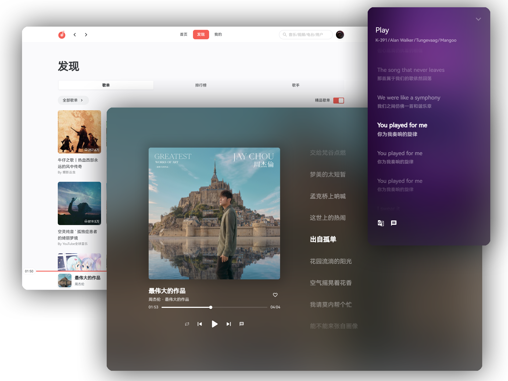

<div align="center">

<h2>SPlayer</h2>
<p>一个简约的在线音乐播放器</p>

</div>
<br />

## 说明

- 本项目采用 [Vue 3](https://cn.vuejs.org/) 全家桶和 [Naïve UI](https://www.naiveui.com/) 组件库及 `SCSS` 开发
- 目前主要以 `Web` 端为主，可能暂时不会考虑使用 `Electron` 构建客户端
- 仅对移动端做了基础适配，**不保证功能全部可用**
- 欢迎各位大佬指点和 `Star` 哦 😍

## 👀 Demo

- [SPlayer](https://music.imsyy.top/)

## 🎉 功能

- 支持扫码登录
- 支持手机号登录（上游接口暂时无法使用）
- 自动进行每日签到及云贝签到
- 支持 [UnblockNeteaseMusic](https://github.com/UnblockNeteaseMusic/server)，自动替换变灰歌曲
  - 由于酷我音源不支持 `https`，故网页端替换可能不全面
- 下载歌曲（最高支持 Hi-Res）
- 新建歌单及歌单编辑
- 收藏 / 取消收藏歌单或歌手
- 每日推荐歌曲
- 私人 FM
- 云盘音乐上传
- 云盘内歌曲播放
- 云盘内歌曲纠正
- 云盘歌曲删除
- 支持逐字歌词
- 歌词滚动以及歌词翻译
- MV 与视频播放
- 音乐频谱显示（ 暂时去除，还待完善 ）
- 音乐渐入渐出
- 支持 PWA
- 支持评论区及评论点赞
- 明暗模式自动 / 手动切换
- 移动端基础适配
- `i18n` 支持

#### 待办

- [ ] 电台节目支持
- [ ] 歌词页面进一步完善
- [ ] 发表评论
- [ ] 重构（写成屎山了） 🤣

## 😍 Screenshots

<details>
<summary>主页面</summary>


</details>

<details>
<summary>播放页面</summary>


</details>

<details>
<summary>发现页面</summary>


</details>

<details>
<summary>歌单页面</summary>


</details>

<details>
<summary>评论页面</summary>


</details>

## ⚙️ 部署

> Vercel 等托管平台可在 Fork 后一键导入并自动部署

### API 服务（必需）

> 本程序依赖 [NeteaseCloudMusicApi](https://github.com/Binaryify/NeteaseCloudMusicApi) 运行，请确保您已成功部署该项目

- 请在根目录下的 `.env` 文件中的 `VITE_MUSIC_API` 中填入 API 地址（必需）

```js
VITE_MUSIC_API = "your api url";
```

### 网易云解灰 API（可选）

如需使用网易云解灰服务，请前往 [UNM-Server](https://github.com/imsyy/UNM-Server) 部署在线 API 服务并将 `API` 地址填入 `.env` 环境变量中，该服务用于网页端替换无法播放或无版权的歌曲。如不需要该服务，请前往站点的 `全局设置` 中关闭

### 安装依赖

```bash
pnpm install
# 或者
yarn install
# 或者
npm install
```

### 开发

```bash
pnpm dev
# 或者
yarn dev
# 或者
npm dev
```

### 构建

```bash
pnpm build
# 或者
yarn build
# 或者
npm build
```

构建完成后可将生成的 `dist` 文件夹内的文件上传至服务器

## 😘 鸣谢

特此感谢为本项目提供支持与灵感的项目

- [NeteaseCloudMusicApi](https://github.com/Binaryify/NeteaseCloudMusicApi)
- [YesPlayMusic](https://github.com/qier222/YesPlayMusic)
- [UnblockNeteaseMusic](https://github.com/UnblockNeteaseMusic/server)
- [BlurLyric](https://github.com/Project-And-Factory/BlurLyric)
- [Vue-mmPlayer](https://github.com/maomao1996/Vue-mmPlayer)

## 📜 开源许可

- **本项目仅供个人学习研究使用，禁止用于商业及非法用途**
- 本项目基于 [MIT license](https://opensource.org/license/mit/) 许可进行开源

## 📢 免责声明

本项目使用了网易云音乐的第三方 API 服务，**仅供个人学习研究使用，禁止用于商业及非法用途。** 本项目旨在提供一个前端练手的实战项目，用于帮助开发者提升技能水平和对前端技术的理解

同时，本项目开发者承诺 **严格遵守相关法律法规和网易云音乐 API 使用协议，不会利用本项目进行任何违法活动。** 如因使用本项目而引起的任何纠纷或责任，均由使用者自行承担。**本项目开发者不承担任何因使用本项目而导致的任何直接或间接责任，并保留追究使用者违法行为的权利**

请使用者在使用本项目时遵守相关法律法规，**不要将本项目用于任何商业及非法用途。如有违反，一切后果由使用者自负。** 同时，使用者应该自行承担因使用本项目而带来的风险和责任。本项目开发者不对本项目所提供的服务和内容做出任何保证
